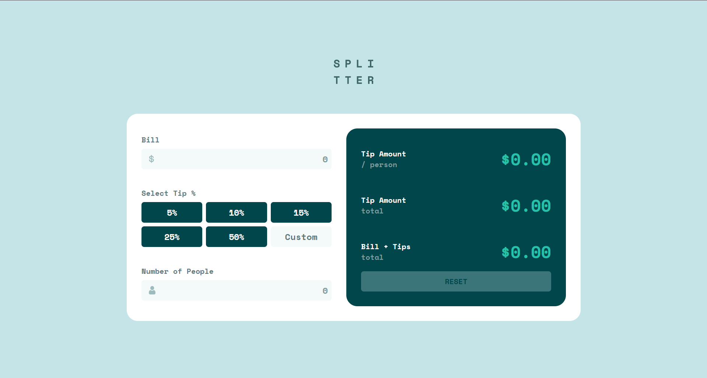

# Frontend Mentor - Tip calculator app solution

This is a solution to the [Tip calculator app challenge on Frontend Mentor](https://www.frontendmentor.io/challenges/tip-calculator-app-ugJNGbJUX). Frontend Mentor challenges help you improve your coding skills by building realistic projects.

### The challenge

Users should be able to:

- View the optimal layout for the app depending on their device's screen size
- See hover states for all interactive elements on the page
- Calculate the correct tip and total cost of the bill plus tips

### Screenshot

### Links

- Solution URL: [https://oribautista99.github.io/tip-calculator/](https://oribautista99.github.io/tip-calculator/)

## My process

### Built with

- Semantic HTML5 markup
- CSS custom properties
- Flexbox
- CSS Grid
- Mobile-first workflow
- JavaScript

## Author

- Website - [oribautista99](https://oribautista99.netlify.app/)
- Linkedin - [@orianaBautista](www.linkedin.com/in/oriana-stefany-bautista-iscala-b55a04211

)
